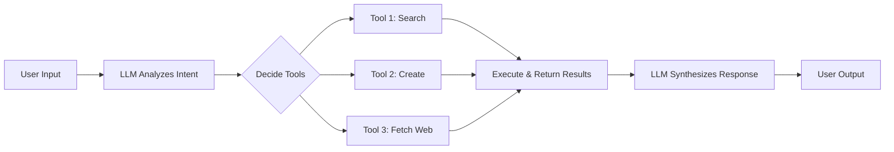
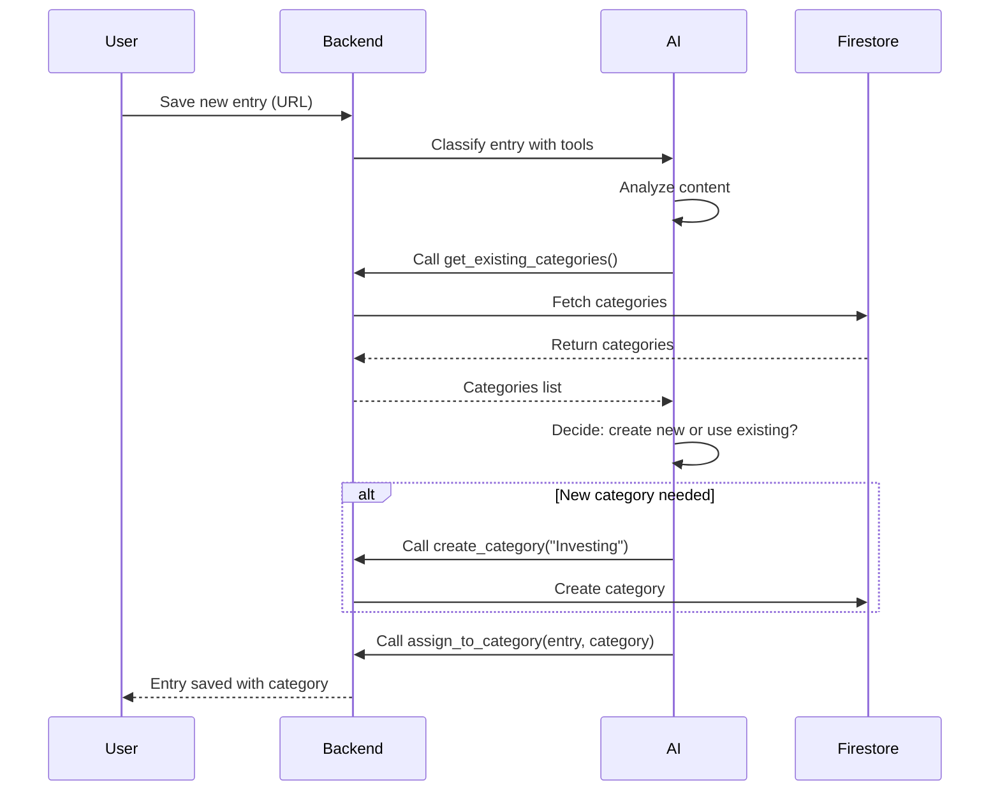
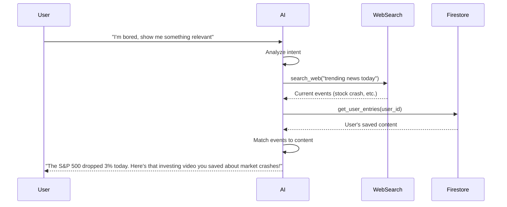

# 🧠 Thinkback AI Tools Specification

This document outlines all AI tool calling features to be implemented in thinkback.

---

## Overview

AI tool calling (function calling) allows the LLM to decide which functions to invoke based on user intent. Instead of just returning text, the AI can autonomously execute actions, search data, and orchestrate complex workflows.



---

## Feature 1: AI-Driven Category Management

**Priority:** High  
**Location:** `backend/ai.py` → integrate into `classify_entry()` pipeline

### Purpose
Let the AI autonomously decide whether to create new categories, reuse existing ones, or merge similar categories when saving new content.

### Tools

| Tool Name | Description | Parameters |
|-----------|-------------|------------|
| `get_existing_categories` | Fetch all user's current categories | `user_id: str` |
| `check_category_similarity` | Check if a category name is similar to existing ones | `name: str, threshold: float` |
| `create_category` | Create a new category for the user | `name: str, ai_generated: bool` |
| `assign_to_category` | Assign an entry to a category | `entry_id: str, category_id: str` |

### Tool Definitions

```python
tools = [
    {
        "type": "function",
        "function": {
            "name": "get_existing_categories",
            "description": "Get all existing categories for the user to avoid creating duplicates",
            "parameters": {
                "type": "object",
                "properties": {
                    "user_id": {
                        "type": "string",
                        "description": "The user's unique identifier"
                    }
                },
                "required": ["user_id"]
            }
        }
    },
    {
        "type": "function",
        "function": {
            "name": "create_category",
            "description": "Create a new category. Only use if no similar category exists.",
            "parameters": {
                "type": "object",
                "properties": {
                    "name": {
                        "type": "string",
                        "description": "Name of the new category"
                    },
                    "ai_generated": {
                        "type": "boolean",
                        "description": "Whether this category was AI-generated",
                        "default": True
                    }
                },
                "required": ["name"]
            }
        }
    },
    {
        "type": "function",
        "function": {
            "name": "assign_to_category",
            "description": "Assign the current entry to an existing category",
            "parameters": {
                "type": "object",
                "properties": {
                    "category_id": {
                        "type": "string",
                        "description": "ID of the category to assign to"
                    }
                },
                "required": ["category_id"]
            }
        }
    }
]
```

### Flow



---

## Feature 2: Semantic Search Chat

**Priority:** High  
**Location:** New endpoint `POST /api/chat` in `backend/router.py`

### Purpose
Replace/enhance fuzzy search with natural language understanding. Users can ask questions like "find that productivity video from last week" instead of typing keywords.

### Tools

| Tool Name | Description | Parameters |
|-----------|-------------|------------|
| `search_entries` | Semantic search across user's saved entries | `query: str, platform?: str, date_range?: object` |
| `get_entry_details` | Get full details of a specific entry | `entry_id: str` |
| `list_categories` | List all user categories | - |
| `filter_by_category` | Get entries in a specific category | `category_id: str` |
| `get_recent_entries` | Get most recently saved entries | `limit: int` |

### Tool Definitions

```python
tools = [
    {
        "type": "function",
        "function": {
            "name": "search_entries",
            "description": "Search user's saved entries using semantic understanding. Use this when the user wants to find specific content.",
            "parameters": {
                "type": "object",
                "properties": {
                    "query": {
                        "type": "string",
                        "description": "Natural language search query"
                    },
                    "platform": {
                        "type": "string",
                        "enum": ["youtube", "tiktok", "instagram", "reddit", "twitter", "linkedin"],
                        "description": "Filter by platform (optional)"
                    },
                    "date_range": {
                        "type": "object",
                        "properties": {
                            "from": {"type": "string", "description": "Start date ISO format"},
                            "to": {"type": "string", "description": "End date ISO format"}
                        }
                    }
                },
                "required": ["query"]
            }
        }
    },
    {
        "type": "function",
        "function": {
            "name": "get_entry_details",
            "description": "Get full details of a specific saved entry including notes, tags, and metadata",
            "parameters": {
                "type": "object",
                "properties": {
                    "entry_id": {
                        "type": "string",
                        "description": "The unique ID of the entry"
                    }
                },
                "required": ["entry_id"]
            }
        }
    },
    {
        "type": "function",
        "function": {
            "name": "filter_by_category",
            "description": "Get all entries in a specific category",
            "parameters": {
                "type": "object",
                "properties": {
                    "category_name": {
                        "type": "string",
                        "description": "Name of the category to filter by"
                    }
                },
                "required": ["category_name"]
            }
        }
    },
    {
        "type": "function",
        "function": {
            "name": "get_recent_entries",
            "description": "Get the most recently saved entries",
            "parameters": {
                "type": "object",
                "properties": {
                    "limit": {
                        "type": "integer",
                        "description": "Number of entries to return",
                        "default": 10
                    }
                }
            }
        }
    }
]
```

### Example Conversations

| User Says | AI Tool Calls | Response |
|-----------|--------------|----------|
| "Find that cooking video I saved" | `search_entries("cooking video")` | Returns matching entries |
| "What did I save from TikTok last week?" | `search_entries("", platform="tiktok", date_range={...})` | TikTok entries from last week |
| "Show me my productivity stuff" | `filter_by_category("Productivity")` | Category entries |
| "What was my most recent save?" | `get_recent_entries(limit=1)` | Last saved entry |

---

## Feature 3: World Events Recommendations

**Priority:** Medium-High  
**Location:** New service `backend/services/recommendations.py`

### Purpose
Connect real-world events to user's saved content. When something happens in the world (stock market crash, sports event, etc.), surface relevant saved content.

### Tools

| Tool Name | Description | Parameters |
|-----------|-------------|------------|
| `search_web` | Search the web for current events/news | `query: str` |
| `get_trending_topics` | Get current trending topics | `category?: str` |
| `get_user_entries` | Get user's saved entries | `limit: int, filters?: object` |
| `match_content_to_events` | Find saved content relevant to current events | `events: list, entries: list` |
| `get_user_interests` | Analyze user's categories/tags to understand interests | `user_id: str` |

### Tool Definitions

```python
tools = [
    {
        "type": "function",
        "function": {
            "name": "search_web",
            "description": "Search the web for current news and events. Use to understand what's happening in the world right now.",
            "parameters": {
                "type": "object",
                "properties": {
                    "query": {
                        "type": "string",
                        "description": "Search query for current events"
                    },
                    "news_only": {
                        "type": "boolean",
                        "description": "Only return news articles",
                        "default": True
                    }
                },
                "required": ["query"]
            }
        }
    },
    {
        "type": "function",
        "function": {
            "name": "get_trending_topics",
            "description": "Get currently trending topics across news and social media",
            "parameters": {
                "type": "object",
                "properties": {
                    "category": {
                        "type": "string",
                        "enum": ["general", "technology", "finance", "sports", "entertainment", "politics"],
                        "description": "Category to filter trends"
                    }
                }
            }
        }
    },
    {
        "type": "function",
        "function": {
            "name": "get_user_interests",
            "description": "Analyze user's saved content to understand their interests",
            "parameters": {
                "type": "object",
                "properties": {
                    "user_id": {
                        "type": "string",
                        "description": "User's unique identifier"
                    }
                },
                "required": ["user_id"]
            }
        }
    },
    {
        "type": "function",
        "function": {
            "name": "recommend_content",
            "description": "Recommend saved content based on current context and events",
            "parameters": {
                "type": "object",
                "properties": {
                    "context": {
                        "type": "string",
                        "description": "Current context or event description"
                    },
                    "limit": {
                        "type": "integer",
                        "description": "Number of recommendations",
                        "default": 3
                    }
                },
                "required": ["context"]
            }
        }
    }
]
```

### Flow



### External API Integration

For web search, integrate one of:
- **Tavily API** (recommended for AI apps)
- **Serper API** (Google search)
- **Brave Search API**
- **NewsAPI** (news-specific)

---

## Feature 4: Advanced AI Scraping (Future)

**Priority:** Low  
**Location:** `backend/scrapers/` - enhance existing scrapers

### Purpose
Let AI dynamically decide what to extract from content instead of hard-coded scraping logic.

### Tools

| Tool Name | Description | Parameters |
|-----------|-------------|------------|
| `extract_key_points` | Extract main points from content | `content: str` |
| `identify_topics` | Identify topics discussed | `content: str` |
| `extract_mentions` | Find mentioned people, products, links | `content: str` |
| `summarize_content` | Generate a summary | `content: str, max_length: int` |
| `detect_content_type` | Determine what type of content this is | `url: str, metadata: object` |

---

## Feature 5: Smart Deduplication

**Priority:** Medium  
**Location:** Add to save pipeline in `backend/router.py`

### Purpose
Prevent saving duplicate content by letting AI identify similar entries.

### Tools

| Tool Name | Description | Parameters |
|-----------|-------------|------------|
| `find_similar_entries` | Find entries similar to a URL or content | `url: str` or `content: str` |
| `check_exact_duplicate` | Check if exact URL already saved | `url: str` |
| `suggest_merge` | Suggest merging similar entries | `entry_ids: list` |

### Tool Definitions

```python
tools = [
    {
        "type": "function",
        "function": {
            "name": "find_similar_entries",
            "description": "Find entries that are semantically similar to the content being saved",
            "parameters": {
                "type": "object",
                "properties": {
                    "content_summary": {
                        "type": "string",
                        "description": "Summary or title of the content to check"
                    },
                    "threshold": {
                        "type": "number",
                        "description": "Similarity threshold (0-1)",
                        "default": 0.8
                    }
                },
                "required": ["content_summary"]
            }
        }
    },
    {
        "type": "function",
        "function": {
            "name": "check_duplicate",
            "description": "Check if this exact URL has already been saved",
            "parameters": {
                "type": "object",
                "properties": {
                    "url": {
                        "type": "string",
                        "description": "URL to check"
                    }
                },
                "required": ["url"]
            }
        }
    }
]
```

---

## Implementation Priority

| # | Feature | Effort | Impact | Priority |
|---|---------|--------|--------|----------|
| 1 | AI Category Management | Medium | High | 🔴 High |
| 2 | Semantic Search Chat | Medium | High | 🔴 High |
| 3 | World Events Recommendations | High | Very High | 🟡 Medium-High |
| 4 | Smart Deduplication | Low | Medium | 🟡 Medium |
| 5 | Advanced AI Scraping | High | Medium | 🟢 Low |

---

## Technical Requirements

### Dependencies to Add

```txt
# requirements.txt additions
tavily-python>=0.3.0    # For web search
langchain>=0.1.0        # Optional: for complex chains
```

### Environment Variables

```env
# .env additions
TAVILY_API_KEY=your_tavily_key
```

### API Patterns

All tool-calling endpoints should follow this pattern:

```python
from openai import OpenAI

client = OpenAI()

async def execute_with_tools(user_message: str, user_id: str, tools: list):
    messages = [
        {"role": "system", "content": "You are a helpful assistant for thinkback..."},
        {"role": "user", "content": user_message}
    ]
    
    response = client.chat.completions.create(
        model="gpt-4o",
        messages=messages,
        tools=tools,
        tool_choice="auto"
    )
    
    # Handle tool calls
    while response.choices[0].message.tool_calls:
        tool_calls = response.choices[0].message.tool_calls
        messages.append(response.choices[0].message)
        
        for tool_call in tool_calls:
            result = await execute_tool(tool_call, user_id)
            messages.append({
                "role": "tool",
                "tool_call_id": tool_call.id,
                "content": json.dumps(result)
            })
        
        # Get next response
        response = client.chat.completions.create(
            model="gpt-4o",
            messages=messages,
            tools=tools
        )
    
    return response.choices[0].message.content
```

---

## Next Steps

1. [ ] Implement AI Category Management in save pipeline
2. [ ] Create `/api/chat` endpoint for semantic search
3. [ ] Integrate Tavily/web search API
4. [ ] Build world events recommendation system
5. [ ] Add deduplication checks to save flow

---

*Last updated: January 2026*
